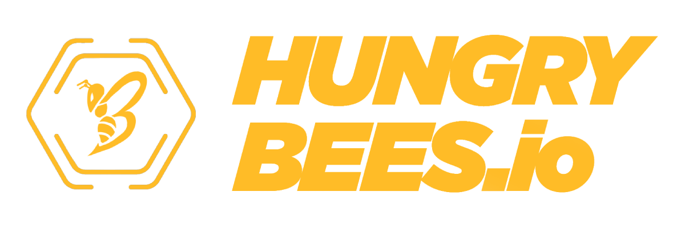

# 🐝 HUNGRYBEES


Do you prefer to read in English? Click here [HungryBees English](https://hungrybees.gitbook.io/whitepaper-english)


HungryBees es una iniciativa cuyo principal propósito es la creación de un metaverso que permita concienciar a la sociedad y especialmente a los más jóvenes, sobre el impacto de nuestras acciones sobre el planeta, fomentando la sostenibilidad y la inversión socialmente responsable, a través del gaming, las nuevas tecnologías y el poder de la sociedad.

Con la creación de una comunidad virtual, a través de una DApp (Distributed App), un modelo "Play to Earn" y un ecosistema de NFTs, queremos tener repercusión e impulsar acciones en el mundo real, ofreciendo la posibilidad de participar en una iniciativa socialmente responsable, que no solo se preocupe de los posibles beneficios, sino que también tenga en cuenta los desafíos medioambientales y su impacto social en el mundo.


.png>)           ****           Environmental, Social, Governance

.png>)       Play-to-Earn Metaverse

.png>)      Token Farming

.png>)      NFT Marketplace


.png>)


Ten cuidado con los SCAMS

* HungreeBees es un metaverso sostenible y confiable&#x20;
* Miembro de The Blockchain Arbitration Society, primera juridisdicción cripto virtual en el mundo ([https://theblockchainarbitration.com/](https://theblockchainarbitration.com))
* Asesorados legalmente por Ferrer-Bonsoms & Sanjurjo, Abogados especializados en blockchain, smartcontracts, ICO y activos digitales ([https://ferrer-bonsoms.com/](https://ferrer-bonsoms.com))
* ICO lanzada en España. Pasamos de paraísos fiscales.
* Siempre sigue nuestros canales oficiales
  * .png>)  [Discord](https://discord.gg/wxmA4YVRgC)
  * &#x20;.png>)   [Instagram](https://instagram.com/hungrybees\_io)
  * &#x20;.png>)  [Twitter](https://twitter.com/Hungrybees\_io)

