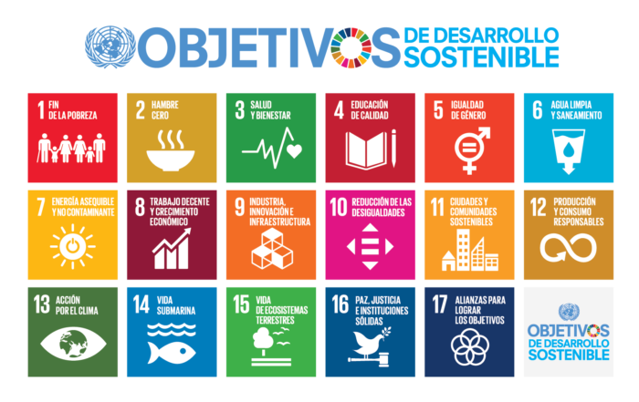

# 🍃 Desarrollo sostenible - ESG

La humanidad afronta el año 2022 sumida en una gran crisis global que no solo pone en riesgo la garantía de los derechos fundamentales de las personas, sino su propia supervivencia, la de muchos seres vivos, y la sostenibilidad del planeta y sus ecosistemas. Esta crisis está marcada por el empobrecimiento generalizado de la población, la globalización, las desigualdades, el cambio climático, el desbordamiento ecológico y el retroceso en los valores y fundamentos democráticos en muchos países.

Estos retos globales nos sitúan ante la obligación de actuar y adoptar una perspectiva global, que promueva el desarrollo sostenible, satisfaciendo las necesidades presentes sin comprometer los recursos y capacidades de las futuras generaciones y garantizando el equilibrio entre el crecimiento económico, el respeto al medio ambiente y el bienestar social.

Desde HungryBees somos conscientes de la situación y estamos comprometidos con el cambio. Por eso, nos hemos embarcado en esta iniciativa, con el fin de concienciar a la sociedad de la necesidad de cambio, fomentando un cambio de paradigma y promoviendo el desarrollo e inversión sostenible.

¿Y cómo lo vamos a hacer? Estamos seguros de que la combinación de las siguientes palancas nos permitirá tener más llegada a la sociedad, conectar con ellos y promover acciones reales y tangibles:

* &#x20;e-games - La imparable tendencia de los juegos en línea y los mundos virtuales como canal para atraer la atención y el interés de los más jóvenes
* Tecnología blockchain y criptoactivos - Con un crecimiento de dos cifras, es claro que el interés en los activos digitales o criptoactivos ha sido impulsado por la transparencia y seguridad que ofrece la tecnología blockchain.
* ESG – Environmental, Social & Governance - El futuro de las finanzas y las inversiones se acerca inexorablemente hacia la sostenibilidad y la responsabilidad social. Se busca una inversión respetuosa con el medio ambiente y que sea más justa con la sociedad.

A continuación, describimos varias de las iniciativas que este proyecto busca impulsar

| **Sostenibilidad Ambiental**                                                                                                                                      | **Sostenibilidad Social**                                                                                            | **Sostenibilidad Económica**                                                                                                                                |
| ----------------------------------------------------------------------------------------------------------------------------------------------------------------- | -------------------------------------------------------------------------------------------------------------------- | ----------------------------------------------------------------------------------------------------------------------------------------------------------- |
| 
Ø  Cambio climático

Ø  Escasez de recursos

Ø  Consumo de energía eficiente y renovable

Ø  Agricultura sostenible

Ø  Emisión de CO2
 | 
Ø  Acceso a servicios financieros

Ø  Económica circular

Ø  Acceso a educación y servicios médicos
 | 
Ø  Inclusión financiera

Ø  Democratizar acceso a inversión

Ø  Riqueza equitativa

Ø  Tolerancia cero a cualquier tipo de corrupción
 |

