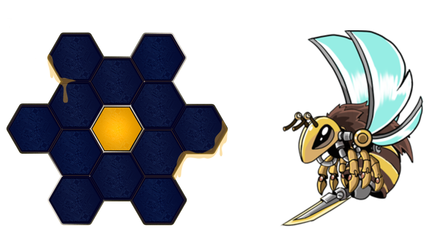

# 🛒 Marketplace

Hungry Bees proporcionará a los usuarios, tanto compradores como vendedores, una plataforma para la compra y venta de activos NFT, tanto colmenas como abejas, de manera abierta y directa en la comunidad.

Desde el juego solo se pondrán a la venta un máximo de 300.000 abejas y 32.500 colmenas, por lo que una vez se hayan acabado, solo será posible adquirir una abeja o colmena a través del Marketplace. La escasez de estos activos NFT hace que dichos ítems no solo sean valiosos por su capacidad de generar #HHON, sino también por el valor intrínseco que tienen en la comunidad.

De esta manera, se permite a los jugadores mantener la propiedad de todos sus ítems adquiridos en el juego, los NFTs, vinculados a sus carteras (wallets) personales. Estos NFT, que serán desplegados sobre Binance Smart Chain, seguirán el estándar BEP-721 y BEP-1155, extensión de los estándares ERC-721 y ERC-1155. Esto permitirá a los jugadores, no solo vender sus activos en nuestro Marketplace, sino poder operar y comerciar con ellos en otros ecosistemas NFT, juegos o mercados descentralizados (Rarible, por ejemplo).

Para garantizar el correcto mantenimiento del Marketplace y del ecosistema, existirá una comisión del 5% por cada venta de NFT. El equipo de gobierno podrá ajustar estas comisiones para equilibrar el mercado y poder incentivar la creación y mantenimiento de la comunidad. Como ejemplo, se abrirá un periodo promocional de 1 semana para la compra de activos NFT de naturaleza única, con características especiales y con una oferta muy limitada.

Adicionalmente habilitaremos un sistema para comprobar el estado de tu donación y comprobar que todo se ha realizado correctamente.

#### Precios de los NFTs

Los precios de los NFTs se mantendrán fijos en su venta inicial hasta que todos hayan sido adquiridos por los apicultores, fijando un precio de 150 #HBEE para las abejas (máximo de 25 abejas por wallet) y 1500 #HBEE para las colmenas (máximo de 5 colmenas por wallet). Sin embargo, durante las preventas, el precio se reducirá a 120 #HBEE y 1200 #HBEE respectivamente. Tanto las colmenas, como las abejas (larvas) serán adquiridas en su primera venta en un formato aleatorio, no sé podrá seleccionar el tipo y rareza de NFT que se desea adquirir.

Tras concluir la venta inicial de los NFTs, estos solo podrán ser intercambiados entre usuarios de la comunidad a través de nuestro Marketplace.

